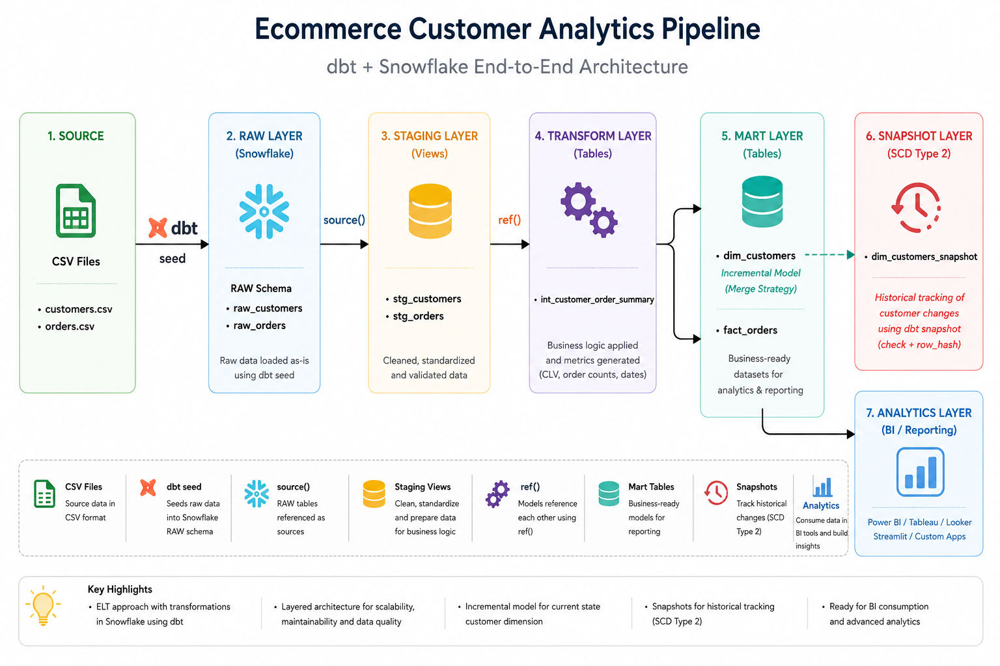
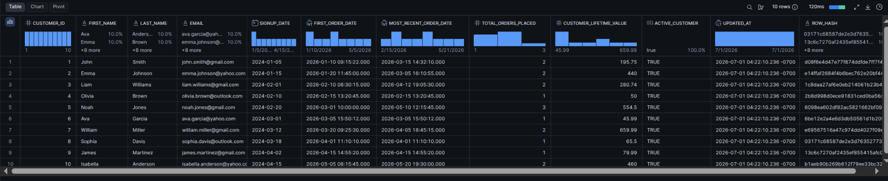
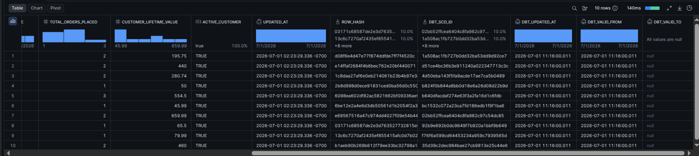
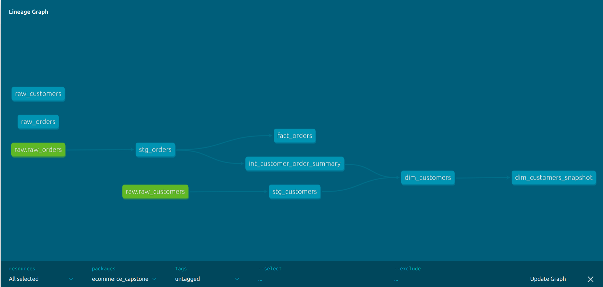
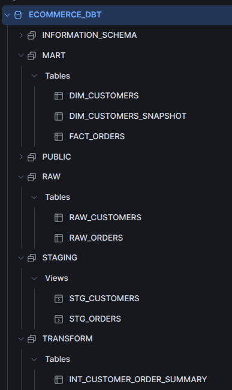
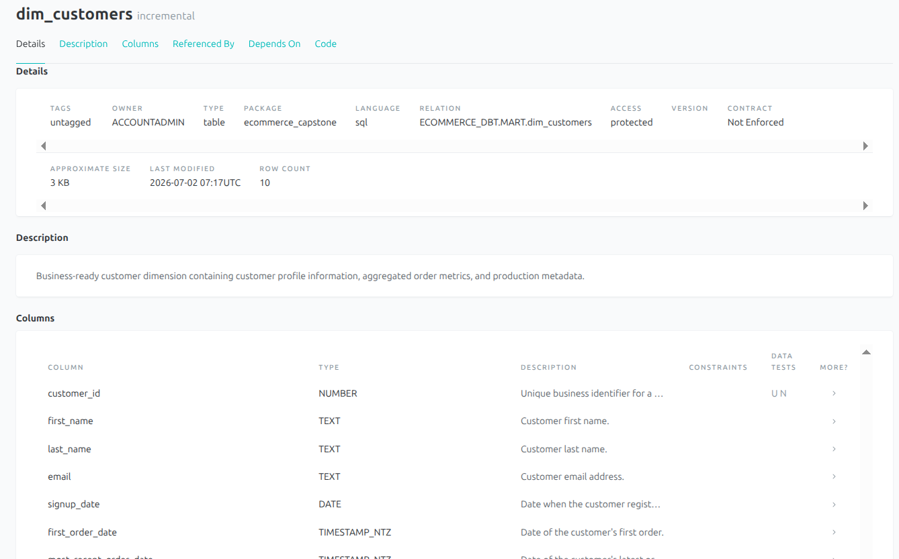

# Ecommerce Customer Analytics Pipeline using dbt & Snowflake

A production-inspired end-to-end **ELT (Extract → Load → Transform)** data engineering project demonstrating how raw customer and order datasets can be transformed into analytics-ready datasets using **dbt** and **Snowflake**.

The project follows modern Analytics Engineering best practices including layered modeling, incremental processing, data quality testing, historical snapshots, automatic lineage generation, and comprehensive project documentation.

---

# Project Overview

This project simulates an ecommerce analytics pipeline where raw customer and order datasets are loaded into Snowflake and transformed into business-ready analytical models.

The final solution consists of:

- Customer Dimension (`dim_customers`)
- Order Fact (`fact_orders`)
- Customer Order Summary (`int_customer_order_summary`)
- Historical Customer Snapshot (`dim_customers_snapshot`)

These curated datasets are designed for direct consumption by Business Intelligence tools such as Power BI, Tableau, Looker, or Streamlit.

---

# Architecture

The project follows a layered Analytics Engineering architecture where raw data is progressively transformed into business-ready analytical models before being consumed by reporting and BI tools.


---

# Technology Stack

| Category | Technology |
|----------|------------|
| Data Warehouse | Snowflake |
| Transformation Framework | dbt Core |
| Language | SQL + Jinja |
| Documentation | dbt Docs |
| Version Control | Git & GitHub |
| Source Data | CSV (Seed Files) |

---

# ELT Pipeline

The project follows an ELT architecture.

```
Extract
    │
    ▼
CSV Files

    │
Load
    ▼

Snowflake RAW Layer

    │
Transform
    ▼

Staging

    ▼

Transform

    ▼

Mart

    ▼

Snapshot

    ▼

Business Intelligence
```

Unlike traditional ETL pipelines, data is first loaded into the warehouse and all transformations are performed inside Snowflake using dbt.

---

# Warehouse Layers

## RAW Layer

Purpose

Store incoming data exactly as received without modification.

Objects

- raw_customers
- raw_orders

Responsibilities

- Landing zone
- Auditing
- Data recovery
- Reproducible project execution using dbt seeds

Materialization

Physical tables created by `dbt seed`.

---

## STAGING Layer

Purpose

Clean and standardize raw datasets while preserving business meaning.

### stg_customers

Transformations

- Rename `id` → `customer_id`
- Normalize customer names using `INITCAP`
- Convert email addresses to lowercase
- Cast signup dates
- Remove customers with missing email addresses

### stg_orders

Transformations

- Rename `user_id` → `customer_id`
- Parse textual timestamps into Snowflake TIMESTAMP values
- Convert numeric status codes into business-friendly labels
- Remove orphan order records

Materialization

View

Reason

Staging models should always reflect the latest raw data while avoiding unnecessary storage.

---

## TRANSFORM Layer

Purpose

Apply reusable business logic and create analytical metrics.

### int_customer_order_summary

Metrics Generated

- First Order Date
- Most Recent Order Date
- Total Orders Placed
- Customer Lifetime Value (CLV)

Materialization

Table

Reason

Aggregations are reused downstream and should not be recalculated repeatedly.

---

## MART Layer

Purpose

Provide business-ready datasets optimized for reporting and analytics.

# Customer Dimension Output

The final dimensional model combines customer information with business metrics such as Customer Lifetime Value (CLV), order counts, and purchase history.



### dim_customers

Contains

- Customer profile
- Customer order metrics
- Active customer indicator
- Audit timestamp
- Row hash for change detection

Materialization

Incremental Merge

---

### fact_orders

Contains

- One record per order
- Customer reference
- Order timestamp
- Business status
- Order amount

Materialization

Table

Reason

Optimized for reporting tools and analytical queries.

---

# Incremental Processing

The customer dimension is implemented as an Incremental Model.

Configuration

```jinja
{{
    config(
        materialized='incremental',
        incremental_strategy='merge',
        unique_key='customer_id',
        on_schema_change='sync_all_columns'
    )
}}
```

Benefits

- Updates only new or modified business records.
- Avoids rebuilding large tables.
- Supports scalable warehouse processing.
- Preserves current-state customer profiles.

---

# Historical Change Tracking

Historical tracking is implemented using dbt Snapshots.

Configuration

- Strategy: `check`
- Change Detection: `row_hash`

Instead of comparing every business column individually, the snapshot monitors a deterministic row hash.

Whenever a business attribute changes, dbt automatically stores a new historical version.

Snapshot metadata maintained by dbt:

- `dbt_valid_from`
- `dbt_valid_to`
- `dbt_updated_at`
- `dbt_scd_id`

This implements Slowly Changing Dimension (SCD Type 2) behavior.

## Snapshot Output

The snapshot below demonstrates historical tracking of customer records using dbt's SCD Type 2 implementation.



---

# Data Quality Testing

The project includes Generic dbt Tests to validate data quality throughout the warehouse.

Implemented Tests

| Test | Purpose |
|------|---------|
| unique | Prevent duplicate business keys |
| not_null | Ensure mandatory fields always contain values |
| relationships | Enforce referential integrity between models |

These tests execute automatically during:

```bash
dbt build
```

ensuring only validated datasets progress through the pipeline.

The project validates:

- Customer uniqueness
- Order uniqueness
- Mandatory customer email addresses
- Mandatory business keys
- Relationships between Customers and Orders
# Project Structure

```
ecommerce_capstone/
│
├── datasets/
│
├── docs/
│   ├── 00_environment.md
│   ├── 01_dbt_fundamentals.md
│   ├── 02_snowflake.md
│   ├── 03_data_warehouse.md
│   ├── 04_project_structure.md
│   ├── 05_interview_notes.md
│   ├── 06_command_cheatsheet.md
│   └── 07_decision_log.md
│
├── models/
│   ├── staging/
│   ├── transform/
│   ├── marts/
│   ├── source.yml
│   ├── staging/schema.yml
│   ├── transform/schema.yml
│   └── marts/schema.yml
│
├── seeds/
│
├── snapshots/
│
├── macros/
│
├── tests/
│
├── dbt_project.yml
│
└── README.md
```

---

# Data Lineage

dbt automatically generates a complete dependency graph using `source()` and `ref()` relationships.

The lineage graph below illustrates the complete flow of data from the RAW layer through Staging, Transform, Mart, and Snapshot models.



The lineage graph provides complete visibility into the transformation pipeline, making it easier to understand model dependencies, debug pipelines, and analyze downstream impact.

> **Screenshot**

```text
images/dbt_lineage.png
```

---

# Source Configuration

The RAW layer is defined using dbt Sources.

Although the project loads reproducible sample datasets using `dbt seed`, downstream transformations consume these tables using `source()` instead of `ref()`.

Example:

```jinja
SELECT *
FROM {{ source('raw', 'raw_customers') }}
```

This mirrors production architectures where RAW tables are populated by external ingestion systems rather than dbt itself.

---

# Snowflake Warehouse

## Snowflake Warehouse

The following screenshot shows the schemas and warehouse objects created during the project.



---

# Running the Project

## Clone Repository

```bash
git clone https://github.com/sajalnema/dbt-snowflake-ecommerce-capstone.git 

cd ecommerce_capstone
```

---

## Create Virtual Environment

```bash
python -m venv dbt-env

source dbt-env/bin/activate
```

---

## Install Dependencies

```bash
pip install dbt-core

pip install dbt-snowflake
```

---

## Configure Snowflake Profile

Update the `profiles.yml` file with your Snowflake account details.

---

## Load Seed Data

```bash
dbt seed
```

---

## Execute Models

```bash
dbt run
```

---

## Run Data Quality Tests

```bash
dbt test
```

---

## Execute Complete Pipeline

```bash
dbt build
```

---

## Create Historical Snapshots

```bash
dbt snapshot
```

---

## Generate Documentation

```bash
dbt docs generate
```

---

## Launch Documentation

```bash
dbt docs serve
```

---

# Business Outcomes

The curated Mart layer enables business users to answer analytical questions such as:

- Who are the highest-value customers?
- What is the Customer Lifetime Value (CLV) for each customer?
- When did a customer place their first order?
- Which customers are currently active?
- Which customers have become inactive?
- How has a customer's profile changed over time?
- What are the latest customer order metrics?

The final models are suitable for direct consumption by:

- Power BI
- Tableau
- Looker
- Streamlit
- Custom Analytics Applications

---

# Documentation

This repository includes detailed engineering notes created throughout the project.

| Document | Description |
|----------|-------------|
| 00_environment.md | Environment setup and installation |
| 01_dbt_fundamentals.md | Core dbt concepts and implementation |
| 02_snowflake.md | Snowflake architecture and configuration |
| 03_data_warehouse.md | Data warehouse concepts and layered architecture |
| 04_project_structure.md | Project organization and model layering |
| 05_interview_notes.md | Interview preparation and project explanation |
| 06_command_cheatsheet.md | Frequently used dbt commands |
| 07_decision_log.md | Engineering decisions and implementation rationale |

## Generated dbt Documentation

The project uses **dbt Docs** to automatically generate searchable model documentation, lineage, metadata, and test information.



---

# Key Features

- Layered ELT architecture
- Modular dbt project structure
- Production-style Source configuration
- Reusable business transformations
- Incremental Merge processing
- Slowly Changing Dimension (SCD Type 2)
- Snapshot-based historical tracking
- Generic data quality tests
- Automatic lineage generation
- Comprehensive project documentation
- Version-controlled Analytics Engineering workflow

---

# Future Enhancements

Potential improvements include:

- Power BI dashboard for customer analytics
- CI/CD using GitHub Actions
- Apache Airflow orchestration
- Data freshness monitoring
- Custom dbt tests
- dbt Exposures for BI assets
- Larger production datasets
- Automated deployment pipeline

---

# Key Learnings

This project provided hands-on experience with:

- Analytics Engineering
- ELT pipeline design
- Snowflake Data Warehouse
- dbt Core
- SQL transformations
- Jinja templating
- Incremental models
- Slowly Changing Dimensions (SCD Type 2)
- Snapshot-based historical tracking
- Data quality testing
- Automatic lineage generation
- Production-inspired project organization

---

# Repository Highlights

- Layered warehouse architecture (RAW → STAGING → TRANSFORM → MART)
- Incremental customer dimension
- Historical snapshots using dbt
- Customer Lifetime Value (CLV) calculations
- Automatic documentation generation
- End-to-end lineage visualization
- Business-ready analytical models

---

# Acknowledgements

This project was developed as a hands-on capstone to learn modern Analytics Engineering practices using dbt and Snowflake.

The implementation emphasizes production-inspired design principles while remaining fully reproducible through seed data, making it suitable for learning, demonstrations, and portfolio purposes.